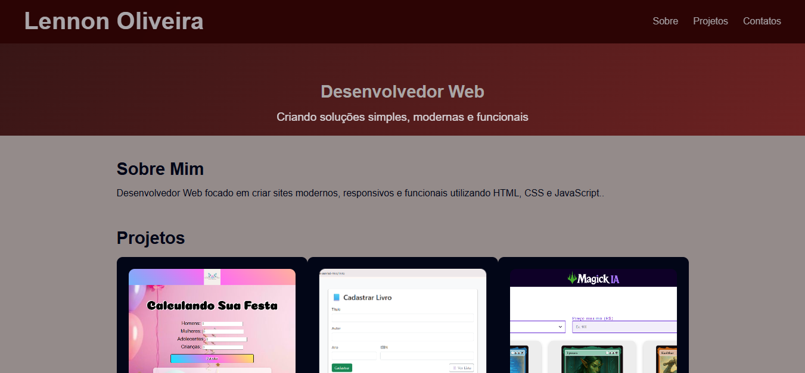
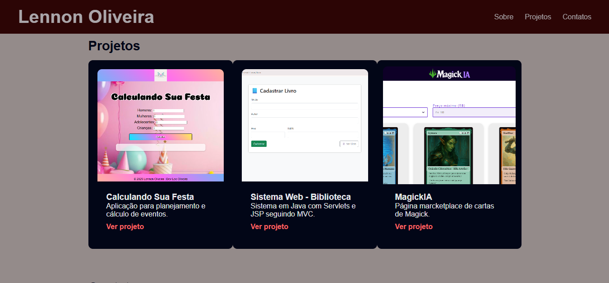
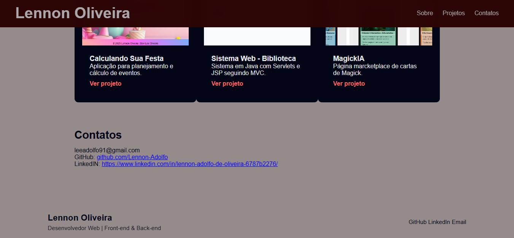

# 💻 Lennon Oliveira | Desenvolvedor Web

Portfólio profissional desenvolvido para apresentar meus projetos, habilidades e formas de contato como **Desenvolvedor Web**, com foco em soluções modernas, responsivas e funcionais.

🔗 **Acesse o site:**  
👉 https://lennon-adolfo.github.io/lennon.oliveira/

---

## 🧑‍💻 Sobre mim

Sou Desenvolvedor Web com foco em criar interfaces modernas, responsivas e funcionais utilizando **HTML, CSS e JavaScript**, além de projetos acadêmicos e práticos com **Java (Servlets e JSP)**.

Atualmente curso **Análise e Desenvolvimento de Sistemas** e utilizo este portfólio para demonstrar minha evolução técnica e projetos desenvolvidos.

---

## 🚀 Tecnologias utilizadas

- HTML5  
- CSS3  
- JavaScript  
- Java (Servlets e JSP)  
- Git & GitHub  
- GitHub Pages  

---

## 📂 Projetos em destaque

### 🎉 Calculando Sua Festa
Aplicação web para planejamento e cálculo de eventos.

- Front-end com HTML, CSS e JavaScript  
- Interface intuitiva e responsiva  

🔗 Repositório:  
https://github.com/Lennon-Adolfo/Calculando-a-sua-festa

---

### 📚 Sistema Web – Biblioteca
Sistema acadêmico desenvolvido em **Java** utilizando:

- Servlets  
- JSP  
- Padrão MVC  

Permite cadastro e listagem de livros.

🔗 Repositório:  
https://github.com/Lennon-Adolfo/biblioteca-servlet-mvc

---

### 🃏 MagickIA
Página estilo marketplace de cartas de Magic.

- Layout moderno  
- Organização de produtos  

🔗 Repositório:  
https://github.com/Lennon-Adolfo/Projeto-MagikIA

---

## 🖼️ Prints do projeto

> Alguns prints do portfólio em funcionamento:
# Página Inicial / Sobre Mim 

# Projetos  

# Contatos

---

## 📬 Contato

- 📧 Email: **leeadolfo91@gmail.com**
- 💼 LinkedIn:  
  https://www.linkedin.com/in/lennon-adolfo-de-oliveira-6787b2276/
- 🐙 GitHub:  
  https://github.com/Lennon-Adolfo

---

## 📌 Status do projeto

✅ Projeto finalizado  
🌐 Publicado no GitHub Pages  
📈 Indexado no Google Search Console  

---

## 📝 Licença

Este projeto é de uso pessoal e educacional.
